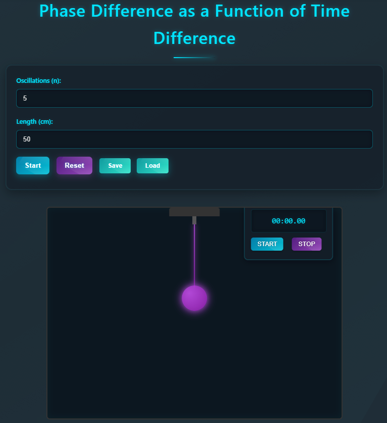
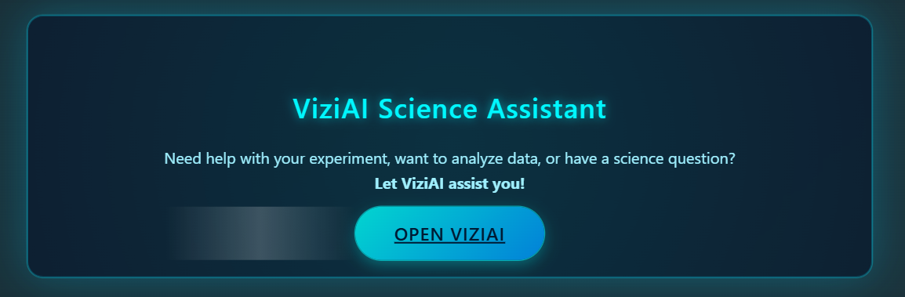

# 🧪 Virtual Lab: Pendulum Simulation & Phase Difference Analyzer

A fully interactive web-based virtual lab built using **Python Flask**, **JavaScript**, **Chart.js**, and **SQLite** that simulates a simple pendulum experiment with **phase difference calculation**, **data recording**, **AI assistance**, and a complete learning flow from theory to quiz.

> 🎓 Built by: Piyush Jangade & Sneha Chaurasia
> 📧 Email: [piyushjangade06@gmail.com](mailto:piyushjangade06@gmail.com)

---

## 📌 Table of Contents

* [Overview](#overview)
* [Features](#features)
* [Screenshots](#screenshots)
* [Tech Stack](#tech-stack)
* [Setup & Installation](#setup--installation)
* [Project Structure](#project-structure)
* [Usage Guide](#usage-guide)
* [Theory](#theory)
* [Prerequisite Quiz](#prerequisite-quiz)
* [AI ViziAPI Interface](#ai-viziapi-interface)
* [Manual](#manual)
* [Roadmap](#roadmap)
* [License](#license)

---

## 📖 Overview

This virtual lab replicates the real-world pendulum experiment, allowing users to:

* Set initial angle and string length.
* Calculate average time period and phase difference.
* Save and load experimental data.
* Export results as CSV.
* Learn the physics behind the experiment with a guided theory section.
* Test themselves using a built-in quiz.
* Use an integrated AI interface (powered by Gemini/Replicate) for smart interaction with experiment content.

---

## ✨ Features

* ⏱️ Real-time pendulum animation
* 🌀 Phase difference and time difference calculation
* 📊 Interactive data table with average period calculator
* 📅 Save, load & export experiment data (CSV)
* 📘 Built-in Theory and Prerequisite Quiz section
* 🤖 ViziAI-powered document and image assistant
* 📄 Styled downloadable manual (PDF)

---

## 📸 Screenshots

### 🔁 Pendulum Simulation Interface



### 🤖 ViziAI Chat Interface



---

## 🛠️ Tech Stack

| Frontend        | Backend        | Database | AI/ML APIs                      |
| --------------- | -------------- | -------- | ------------------------------- |
| HTML5, CSS3, JS | Flask (Python) | SQLite   | Google Gemini API, Replicate SD |

Other Libraries:

* Chart.js (for phase graph)
* Bootstrap 5 (for AI UI)
* PyPDF2 (PDF parsing)
* dotenv, Flask-Limiter, SQLAlchemy

---

## ⚙️ Setup & Installation

### Prerequisites

* Python 3.8+
* Node.js (if planning frontend builds)
* Internet (for AI API integration)

### Instructions

```bash
git clone https://github.com/Piyush-ouch/virtual_lab.git
cd virtual_lab

# Set up virtual env
python -m venv venv
source venv/bin/activate  # On Windows use venv\Scripts\activate

# Install Python dependencies
pip install -r requirements.txt

# Run the Flask server
python app.py
```

> ⚠️ You must create a `.env` file and add:

```
GEMINI_API_KEY=your_gemini_key
FLASK_SECRET_KEY=your_secret_key
```

---

## 🗂️ Project Structure

```
virtual_lab/
│
├── templates/
│   ├── index.html           # Main pendulum UI
│   ├── phytheory.html       # Theory content
│   ├── quiz.html            # MCQ quiz interface
│   ├── viziapi.html         # AI interface
│
├── static/
│   ├── style.css            # Futuristic UI styles
│   └── script.js            # Pendulum logic and interactivity
│
├── uploads/                 # Temporary file uploads for ViziAPI
├── manual.pdf               # Lab manual in PDF
├── pendulum_experiments.db  # SQLite database
├── app.py                   # Flask app
└── README.md                # You’re here!
```

---

## 🚀 Usage Guide

1. Launch the experiment at `http://127.0.0.1:5000`
2. Drag the bob to set initial angle.
3. Set string length and oscillation count.
4. Press **Start** to begin simulation.
5. Use **Save / Load / Export** buttons to manage experiment data.
6. Click **Average Period** to analyze all trials.
7. Explore **Theory** and **Quiz** via top navbar.

---

## 📘 Theory

Theory is hosted at `/phytheory`:

* Covers key definitions like Phase, SHM, Period, Frequency
* Formula: Δφ = (2π / T) × Δt
* Built-in phase calculator tool

---

## ❓ Prerequisite Quiz

Hosted at `/quiz`:

* 8 conceptual MCQs
* Color feedback for correct/wrong answers
* Great for students to revise before experiments

---

## 🤖 AI ViziAPI Interface

Access via `/viziapi-interface`:

* Upload images, PDFs, or enter text
* Smart assistant summarizes, analyzes, and answers queries
* Powered by Google Gemini + Replicate

---

## 📄 Manual

> Download it from the navbar or open directly: [manual.pdf](./manual.pdf)

Covers:

* Getting started instructions
* Features & usage
* Control button guide
* Data export help

---

## 🚣️ Roadmap

* [x] Pendulum simulation with graph
* [x] Save/load/export experimental data
* [x] Phase calculator and theory module
* [x] Prerequisite quiz module
* [x] Gemini-powered document analysis
* [ ] Add audio instructions & accessibility
* [ ] Add mobile-friendly layout
* [ ] Add lab report generator

---

## 📜 License

This project is licensed under the **MIT License**. See `LICENSE` for more information.

---

## 👨‍💻 Authors

* [Piyush Jangade](https://github.com/Piyush-ouch)
* [Sneha Chaurasia](#)

For suggestions or doubts, feel free to [email us](mailto:piyushjangade06@gmail.com).

---

> Made with 💡 passion & precision for experimental learning!
